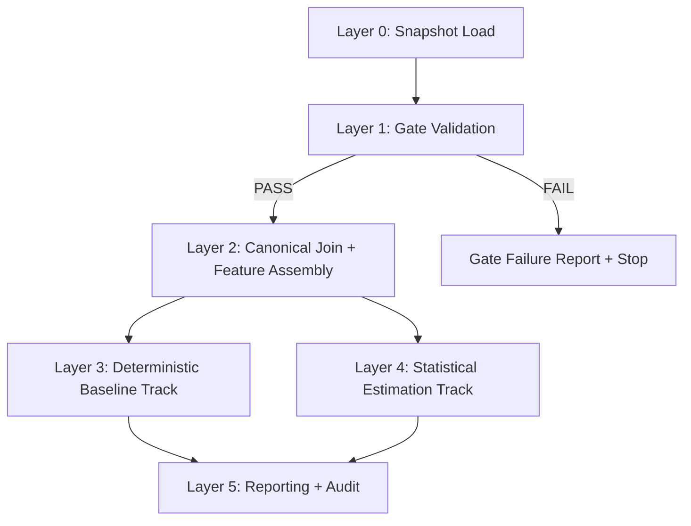

# Phase 3 Pipeline Architecture Specification

## Objective
Define the executable architecture for the estimator pipeline while preserving:
- field separation (DARAJAT vs SALAK),
- auditability to source rows,
- strict separation between deterministic rollups and statistical estimation.

## Authoritative Inputs
- `data/processed/wbs_lv5_master.csv` (Lv.5 row-grain canonical layer)
- `data/processed/wbs_lv5_classification.csv` (Lv.5 class + driver-family layer)
- `data/processed/well_master.csv`
- `data/processed/canonical_campaign_mapping.csv`
- `docs/feature_families.md`

## Architecture Layers

### Layer 0 — Snapshot Contract Load
Load a frozen input snapshot and record:
- data timestamp,
- file hashes,
- row counts,
- schema signature (column names + order).

**Output:** snapshot manifest for reproducibility.

### Layer 1 — Gate Validation
Apply non-negotiable checks before transformation:
1. hierarchy completeness (`wbs_lvl1..wbs_lvl5` non-blank),
2. campaign mapping completeness (`campaign_code`, `campaign_canonical` non-blank),
3. duplicate key checks (`classification_key` must be unique),
4. field-split integrity (`field` in {DARAJAT, SALAK}).

**Fail behavior:** stop pipeline and publish a failed-gate report.

### Layer 2 — Canonical Join & Feature Assembly
Construct analysis-ready design tables by joining master + classification contracts on canonical keys.

Required outputs:
- field-specific design tables,
- deterministic baseline input table,
- statistical feature matrix input table,
- lineage columns preserved (`source_file`, `source_sheet`, `source_row_id`).

### Layer 3 — Deterministic Baseline Track
Generate non-model baseline estimates by field and WBS level:
- quantile/median summaries,
- additive consistency checks for rollups,
- class-aware baseline splits (`well_tied`, `campaign_tied`, `hybrid`).

This track provides reference estimates and QA anchors; it does not infer drivers.

### Layer 4 — Statistical Estimation Track (Design Boundary)
Design interfaces for downstream validation work:
- feature screening inputs,
- holdout split contracts,
- per-field training/validation artifact locations,
- uncertainty artifact schema.

Implementation in later phase must consume Layer 2 outputs without bypassing gates.

### Layer 5 — Reporting & Audit Layer
Publish artifacts for governance and explainability:
- gate report,
- baseline summary by field,
- data sufficiency register,
- assumptions delta,
- version metadata.

## Separation Contract: Deterministic vs Statistical
- Deterministic outputs are reproducible aggregations/summaries from canonical data.
- Statistical outputs must reference validated candidate drivers and include uncertainty.
- No statistical artifact is valid unless the same run has a PASS gate report.

## Field Separation Contract
- DARAJAT and SALAK process in independent branches after Layer 1.
- No pooled parameter estimation by default.
- Any pooled analysis requires explicit statistical justification and assumption-register entry.

## Lineage & Reproducibility Requirements
Every downstream record must retain traceability to the canonical source layer through:
- `source_file`,
- `source_sheet`,
- `source_row_id`,
- canonical WBS key columns,
- run metadata (`run_id`, snapshot timestamp).

## Pipeline Diagram (Mermaid)

## Phase 3 Exit Criteria for this Artifact
- Architecture stages and boundaries are explicit.
- Fail-fast gate behavior is defined.
- Field-specific branching is defined.
- Deterministic and statistical tracks are separated by contract.
